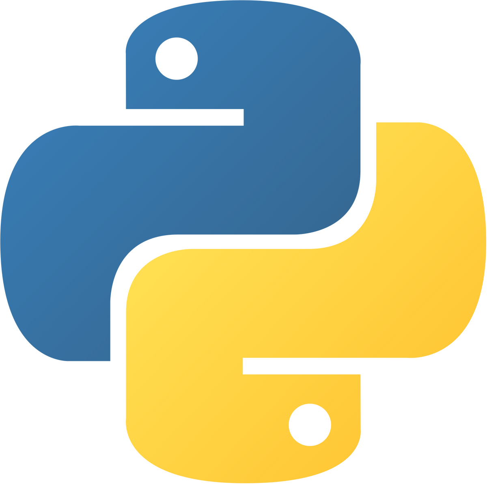

# Hi Everyone!

My name is Carlos, and I am a Software Engineering student at [University of Málaga](https://www.uma.es/grado-en-ingenieria-del-software). I am mostly interested on:

* Cybersecurity
* System Architecture Design
* Backend Developing
* Hardware and Performance
* Some Frontend Designing

## Languajes & Utilities

    <!-- Rust -->
    
    <!-- Java -->
    
    <!-- Python -->
    
    <!-- JavaScript -->
    
    <!-- Vue -->
    
    <!-- C++ -->
    
    <!-- Haskell -->
    
    <!-- C -->
    

    <!-- Arch -->
    
    <!-- Docker -->
    
    <!-- Vim -->
    
    <!-- VSCode -->
    
    <!-- Jetbrains -->
    
    <!-- UML -->
    

## List to learn

    <!-- Ruby -->
    
    <!-- Crystal -->
    
    <!-- Elixir -->
    
    <!-- Lua -->
    
    <!-- Go -->
    

## Projects

